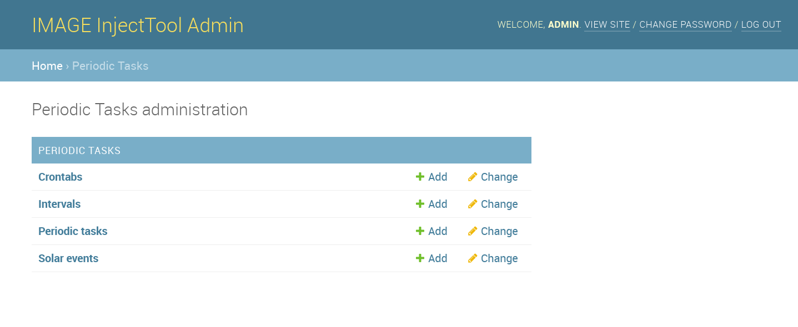

Asynchronous Tasks
==================

Configuring celery environment
------------------------------

Celery is instantiated for all InjectTool in ``image.celery`` module. Briefly,
here celery is started and all defined task need to be readed while defining
environment::

  import os

  from celery import Celery
  from celery.utils.log import get_task_logger

  logger = get_task_logger(__name__)

  # reading configuration from django
  os.environ.setdefault('DJANGO_SETTINGS_MODULE', 'image.settings')

  # starting celery app
  app = Celery('proj')

  # search for tasks inside imported modules
  app.autodiscover_tasks()

More info with celery and django could be found in `First steps with Django`_
documentation

Defining Tasks
--------------

There are two distinct ways of defining celery tasks. The first is by defining
a method and then decorate it with the :py:meth:`celery.Celery.task` method::

  @app.task(bind=True, base=app.Task)
  def clearsessions(self):
      """Cleanup expired sessions by using Django management command."""

      logger.info("Clearing session with celery...")

      # debugging instance
      self.debug_task()

      # calling management command
      management.call_command("clearsessions", verbosity=1)

      # debug
      logger.info("Sessions cleaned!")

      return "Session cleaned with success"

The main advantage of such task is that they are discovered and instantiated in
celery workers automatically using::

    app.autodiscover_tasks()

However, could be difficult to implement complex operations inside a single function.
For such reason, the suggested way to implementing *tasks* is to define tasks as
classes, derived from :py:class:`celery.app.task.Task`::

    class FetchStatusTask(app.Task):
        name = "Fetch USI status"
        description = """Fetch biosample using USI API"""

        def run(self):
            """This function is called when delay is called"""

            # do stuff

You need to declare class based task inside celery environment, otherwise you will
not be able to call a task::

  # register explicitly tasks
  # https://github.com/celery/celery/issues/3744#issuecomment-271366923
  app.tasks.register(FetchStatusTask)

Exclusive Tasks
^^^^^^^^^^^^^^^

In order to execute mutually exclusive task, you need to decorate the run function
like this::

    from common.tasks import BaseTask, NotifyAdminTaskMixin, exclusive_task

    class FetchStatusTask(NotifyAdminTaskMixin, BaseTask):
        name = "Fetch USI status"
        description = """Fetch biosample using USI API"""

        @exclusive_task(task_name="Fetch USI status", lock_id="FetchStatusTask")
        def run(self):

            """This function is called when delay is called"""

            # do stuff

``task_name`` and ``lock_id`` parameters are required for logging and to define
a lock into ``REDIS`` database in order to ensure that this task will be executed
once in the same time (other task will success with *already running* message)

Calling Tasks
-------------

Each task type (decorated function or class based) has a ``run`` method in which
stuff will be executed. By decordating a task, a class object will be instantiated and
the user defined function is called through ``run`` method. For class based tasks,
you have to define the ``run`` method manually. Calling ``run`` method, will execute
stuff synchronously, in the same environment were the function is called. The
execution of operation will be blocked until the ``run`` method returns an output.
Calling task with delay method, will call stuff asynchronously, releasing the caller
immediately and returning an :py:class:`celery.result.AsyncResult` object::

  # will wait until a result is returned by run method
  clearsessions.run()

  # call asynchronous task. Get result object immediately
  result = clearsessions.delay()

  # check task finished:
  if result.ready() is True:
      print(result.info)

Routine Tasks
-------------

Routine tasks are called regularly according to *crontabs* defined in InjectTool
database. They derive from :py:class:`celery.app.task.Task` as any other task,
but they require additional configuration in order to be called regularly. This
configuration can be added in :py:class:`django.conf.settings` as follow::

  from celery.schedules import crontab

  # Other Celery settings
  CELERY_BEAT_SCHEDULE = {
    'clearsessions': {
        'task': 'image.celery.clearsessions',
        'schedule': crontab(hour=12, minute=0),
    },
    'fetch_biosample_status': {
        'task': "Fetch USI status",
        'schedule': crontab(hour="*", minute='*/15'),
    }
  }

:py:class:`celery.schedules.crontab` is the object required to define regular time
intervals. Defining regular tasks in ``image.settins`` let to generate records in
database using `django-celery-beat`_ django package. You could also define periodic
task using :py:mod:`django.contrib.admin`

However defining periodic task in settings let to create `django-celery-beat`_ database
records, if such tasks are not present in the database when InjectTool is started

.. _`django-celery-beat`: https://pypi.org/project/django-celery-beat/
.. _`First steps with Django`: https://docs.celeryproject.org/en/latest/django/first-steps-with-django.html
