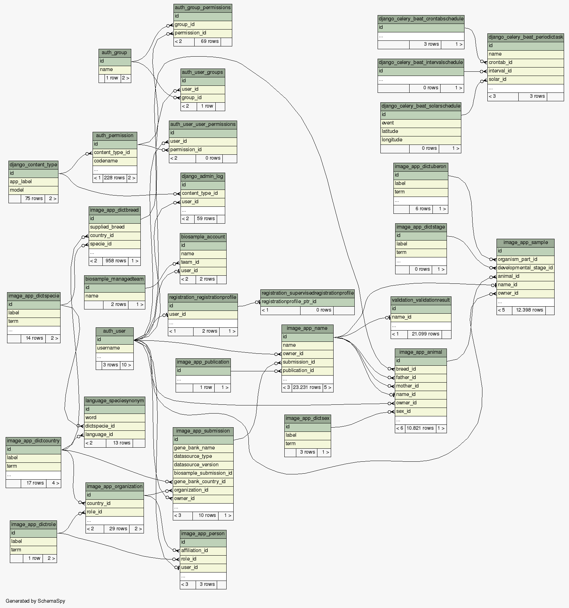

InjectTool Databases
====================

Cryoweb helper database
-----------------------

The cryoweb database is modeled started from an empty cryoweb instance. It models
the minimal permission and table definitions in order to make possible to upload
cryoweb data from a postrges *data only* dump file. This database is filled by
:ref:`cryoweb <cryoweb-app>` module, using :py:meth:`cryoweb.tasks.import_from_cryoweb`.
After import is done (with success or not), database is cleaned and restored to
the original state.

The Unified Internal Database
-----------------------------

The **Unified Internal Database (UID)** is the database in which all IMAGE-InjectTool
data are stored. It is mainly managed by :py:mod:`image_app.models` package, and
models *dictionary tables*, which are used to provides ontologies references, and
*data tables*, which are used to store user data like Animals (Organisms) and Samples
(Specimens from Organim). *Data tables* are linked to user (owner) in order to
be :ref:`private <Private data>` for user who owns such data, while *dictionary
tables* are common for all user in order to facilitate ontology update and resolve
the same terms with the same ontology.

Near the UID tables, there are also :py:mod:`biosample.models` tables, which keep
the relationship between InjectTool users and `EBI AAP`_ users; :py:mod:`validation.models`
tables, which keep information abou data validation performed against `IMAGE-metadata`_
rules through `IMAGE-ValidationTool`_ package; :py:mod:`language.models`, which models
tables related to language specific term (like species names)

Here is an example picture of UID relationships:

The Redis Database
------------------

This database acts as a temporary space required to :py:class:`celery.app.task.Task`.
and its derived classes defined in InjectTool modules *tasks.py* packages. It
stores also the user generated token after a user start a submission using
:py:class:`biosample.views.SubmitView`

.. _`IMAGE-ValidationTool`: https://github.com/cnr-ibba/IMAGE-ValidationTool
.. _`IMAGE-metadata`: https://github.com/cnr-ibba/IMAGE-metadata
.. _`EBI AAP`: https://explore.aai.ebi.ac.uk/home
