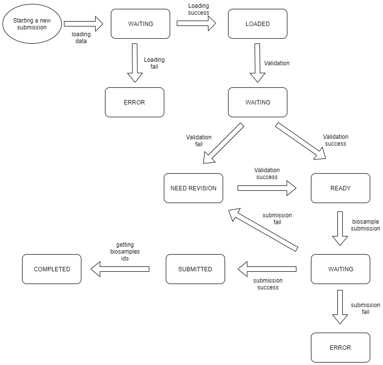

Common App
==========

.. _common-app:

common.constants
----------------

Here are defined values used in other modules. Those values are
used in enum database fields, in particular with django menus in forms. A lot of
class defined here are derived from the :py:class:`enum.Enum` class and :py:class:`common.constants.EnumMixin`,
which let to get a enum number value from an Enum object, as described in chapter
``6.4.8`` of `Two scoops of django`_::

  from common.constants import STATUSES

  WAITING = STATUSES.get_value("waiting")

``WAITING`` in this example is the numerical representation of ``waiting`` status
in the :ref:`The Unified Internal Database`. Other values stored in this modules
are the *API endpoints* used for BioSamples submission, the different annotation
confidences used in the ontology tables or the fields that are listed within the
batch update views used for fix data in a submission.

Common statuses
^^^^^^^^^^^^^^^

Statuses are applied for a :py:class:`uid.models.Submission` and
:py:class:`biosample.models.Submission` and reflect what happened to submissions
and what is possible to do with submission. Here are the main statuses:

- **WAITING**: means a processing phase where no user access is intended to data. While
  in this status data are checked, submitted or loaded and no update/deletion should
  occur in this stage. Model and views should have their methods to prevent user access
  during this phase.
- **LOADED**: means that data were correctly loaded insided :ref:`The Unified Internal Database`.
  data could be modified but need to be validated before submission
- **ERROR**: error is a status that should never be seen. It mean an issue in InjectTool
  itself or an error in data import. Entries in such status need to be verified
- **READY**: this status means that the validation is successful, and data could be
  submitted to biosample.
- **NEED_REVISION**: this status mean an issue in validation, or an error in biosample
  submission. Data need changes in order to be correctly subitted to biosample.
- **SUBMITTED**: this status mean that data were submitted to biosample and the system
  is waiting for ``USI`` response in order to collect ``biosample_ids`` and complete
  the submission.
- **COMPLETED**: this status means that data were correctly submitted to biosample and
  that they received a ``biosample_id``. After such status, you need to refer to
  ``biosample_id`` to update or change such data.

.. _submission_statuses:

Status could change as described by this figure:

A subset of such statuses are applied also to :py:class:`uid.models.Animal`
and :py:class:`uid.models.Sample` objects (``LOADED``, ``READY``, ``NEED_REVISION``,
``SUBMITTED``, ``COMPLETED``). Their meaning is the same of submission statuses.

Common confidences
^^^^^^^^^^^^^^^^^^

This :py:class:`enum.Enum` class models annotation confidence in dictionary tables
after annotation with ``zooma``. Even if all annotation statuses are possible, there
are three mainly chosen statuses:

- **CURATED**: means that this ontology term is annotated manually
- **GOOD** and **HIGH**: those are annotation accuracies as provided by ``zooma``

common.constants module contents
^^^^^^^^^^^^^^^^^^^^^^^^^^^^^^^^

.. automodule:: common.constants
   :members:
   :show-inheritance:
   :undoc-members:

common.fields
-------------

common.fields module contents
^^^^^^^^^^^^^^^^^^^^^^^^^^^^^

.. automodule:: common.fields
  :members:
  :show-inheritance:
  :undoc-members:

common.forms
------------

common.forms module contents
^^^^^^^^^^^^^^^^^^^^^^^^^^^^

.. automodule:: common.forms
  :members:
  :show-inheritance:
  :undoc-members:

common.helpers
--------------

common.helpers module contents
^^^^^^^^^^^^^^^^^^^^^^^^^^^^^^

.. automodule:: common.helpers
  :members:
  :show-inheritance:
  :undoc-members:

common.storage
--------------

common.storage module contents
^^^^^^^^^^^^^^^^^^^^^^^^^^^^^^

.. automodule:: common.storage
  :members:
  :show-inheritance:
  :undoc-members:

common.tasks
------------

common.tasks module contents
^^^^^^^^^^^^^^^^^^^^^^^^^^^^

.. automodule:: common.tasks
  :members:
  :show-inheritance:
  :undoc-members:

common.tests
------------

common.tests module contents
^^^^^^^^^^^^^^^^^^^^^^^^^^^^

.. automodule:: common.tests
  :members:
  :show-inheritance:
  :undoc-members:

common.views
------------

common.views module contents
^^^^^^^^^^^^^^^^^^^^^^^^^^^^

.. automodule:: common.views
   :members:
   :show-inheritance:
   :undoc-members:

.. _`Two scoops of django`: https://www.twoscoopspress.com/products/two-scoops-of-django-1-11
