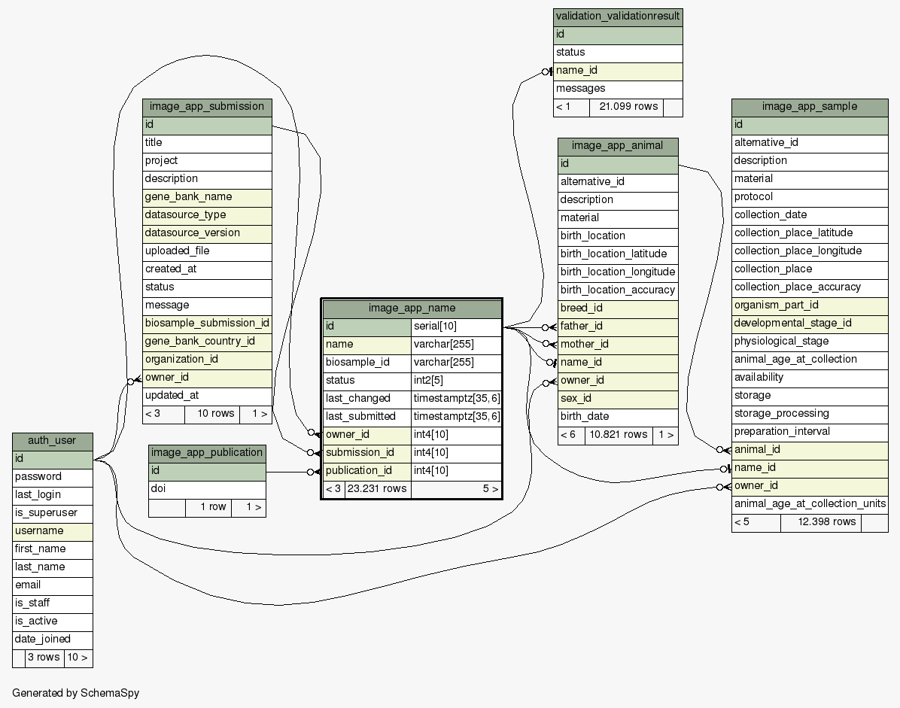

Image_app App
=============

.. _image_app-app:

All stuff related with image :ref:`The Unified Internal Database` and site pages like index and about
are defined in this module.

image_app.models
----------------

Submission and user data
^^^^^^^^^^^^^^^^^^^^^^^^

Inside model library, you can manage :ref:`The Unified Internal Database` objects.
The main object is :py:class:`image_app.models.Submission` which is the object that
a registered user create when starts creating a new submission. Animals and Samples
data loaded by user are manged by the :py:class:`image_app.models.Animal` and
:py:class:`image_app.models.Sample` class. The original name of such objects (defined
as ``Data source id`` from the IMAGE-metadata rules) is managed by :py:class:`image_app.models.Name`
class, which track also the ``biosample_id`` of such objects and its :ref:`Common statuses`.
Here are presented the relations between ``Names`` objects:

Through name relationship, you could rerieve all animal belonging to a submission,
for example::

  from image_app.models import Submission, Animal

  submission = Submission.objects.get(pk=1)
  animals = Animal.objects.filter(name__submission=submission)

in this example ``animals`` is a :py:class:`django.db.models.query.QuerySet` instance
with all animals defined in selected submission.

Private data
^^^^^^^^^^^^

Submission data are considered private to the user when they are stored in
:ref:`The Unified Internal Database`. Each table (:py:class:`django.models.Model`)
has an ``owner`` column in which a relation to :py:class:`django.contrib.auth.models.User`
is defined. In such way, is possible to get all objects belonging to such user::

  from image_app.models import User

  user = User.objects.get(username="test")
  user_animals = Animal.objects.filter(owner=user)

:py:class:`django.contrib.auth.models.User` are also contained in authenticated
sessions, and could be used in Views::

  user_animals = Animal.objects.filter(owner=request.user)

The :py:class:`common.views.OwnerMixin` extends the default ``get_queryset`` of
:py:class:`django.views.generic.detail.SingleObjectMixin` in order to filter
``QuerySet`` using ``self.request.user``. Such Mixin can be inherited by all
:py:class:`django.views.generic.detail.SingleObjectMixin` and
:py:class:`django.views.generic.list.MultipleObjectMixin` derived classes in
order to filter objects relying on django authenticated sessions::

  from django.views.generic import DetailView, ListView

  from image_app.models import Submission
  from common.views import OwnerMixin

  class DetailSubmissionView(OwnerMixin, DetailView):
      model = Submission
      template_name = "submissions/submission_detail.html"

  class ListSubmissionsView(OwnerMixin, ListView):
      model = Submission
      template_name = "submissions/submission_list.html"
      ordering = ['-created_at']
      paginate_by = 10

since :py:class:`common.views.OwnerMixin` inherits from
:py:class:`django.contrib.auth.mixins.LoginRequiredMixin`, an authentication
sessions is required to access to derived views. The login redirect will be managed
if the session is anonymous

image_app.models module contents
^^^^^^^^^^^^^^^^^^^^^^^^^^^^^^^^

.. automodule:: image_app.models
   :members:
   :show-inheritance:
